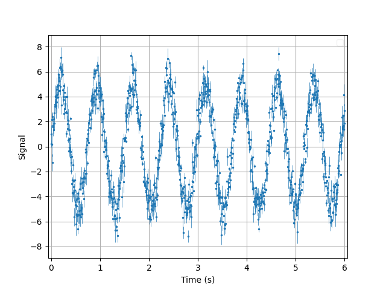
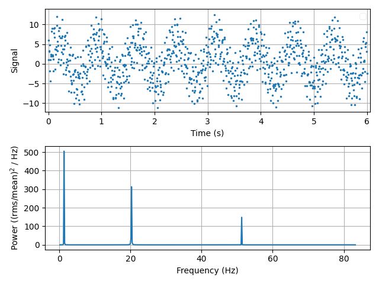
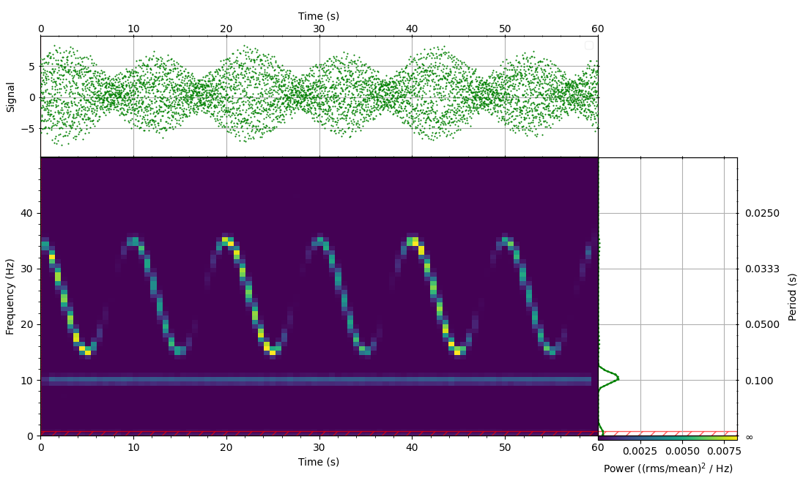

# tsa: Time Series Analysis Tools

<!-- 
TODO
[](https://travis-ci.com/astromancer/tsa)
[](https://tsa.readthedocs.io/en/latest/?badge=latest)
[](https://pypi.org/project/tsa)
[](https://tsa.readthedocs.io/en/latest/license.html)
 -->

This project is for Time Series Analysis and Frequency Spectal Estimation. It
allows for convenient computation of periodograms and spectrograms (aka Dynamic
Power Spectrum) as well as enabling plotting of multivariate time series and
interactive Time-Frequency Representations of data.


# Install

  ```shell
  pip install tsa
  ```

# Use

## Time Series
```python
import numpy as np
from tsa import TimeSeries


# generate data
np.random.seed(54321)
n = 1000                                        # number of points
A = 5                                           # amplitude
ω = 1.35  * 2 * np.pi                           # angular frequency
t = np.linspace(0, 6, n)                        # time
signal = A * np.sin(ω * t) + np.random.randn(n)
errors = np.random.rand(n)                      # uniformly distributed uncertainties

# create time series
ts = TimeSeries(t, signal, errors)
tsp = ts.plot()
```



## Periodogram
As an example, we generate a multi-tone harmonic signal:
```python
from tsa.ts.generate import Harmonic

harmonic = Harmonic(amplitudes=[5, 4.3, 2.7],
                    frequencies=[1.35, 20.27, 51.3])
ts = TimeSeries(t, harmonic(t))
# compute the periodogram and plot it
pg = ts.periodogram(normalize='rms')
pg.plot()
```



## Spectrogram and Time-Frequency Representations
In this example, we generate an amplitude- and frequency modulated signal.
Compute the spectrogram and plot a Time-Frequency Representation (TFR) of the
data.

```python
fs = 100                                            # sampling frequency
fc = 25                                             # carier signal
fm = 0.1                                            # modulation frequency
Δf = 10                                             # frequency deviation
duration = 60
t = np.linspace(0, duration, duration * fs)
a = Harmonic(5, 0.05, np.pi / 4)(t)                 # amplitude (modulated)
signal = a * np.cos(2 * np.pi * fc * t + (Δf / fm) * np.sin(2 * np.pi * fm * t))

ts = TimeSeries(t, signal)
tfr = ts.tfr(nwindow=128, noverlap='50%', normalize='rms')
```  



# Interactive features
To activate the interactive features of the map:
```python
tfr.connect()  
```

<!-- For more examples see [Documentation]() -->

<!-- # Documentation -->

<!-- # Test

The [`test suite`](./tests/test_splice.py) contains further examples of how
`DocSplice` can be used.  Testing is done with `pytest`:

```shell
pytest tsa
``` -->

# Contribute
Contributions are welcome!

1. [Fork it!](https://github.com/astromancer/tsa/fork)
2. Create your feature branch\
    ``git checkout -b feature/rad``
3. Commit your changes\
    ``git commit -am 'Add some cool feature 😎'``
4. Push to the branch\
    ``git push origin feature/rad``
5. Create a new Pull Request

# Contact

* e-mail: hannes@saao.ac.za

<!-- ### Third party libraries
 * see [LIBRARIES](https://github.com/username/sw-name/blob/master/LIBRARIES.md) files -->

# License

* see [LICENSE](https://github.com/astromancer/tsa/blob/master/LICENSE)

<!-- 
# Version
This project uses a [semantic versioning](https://semver.org/) scheme. The 
latest version is
* 0.0.1
 -->
